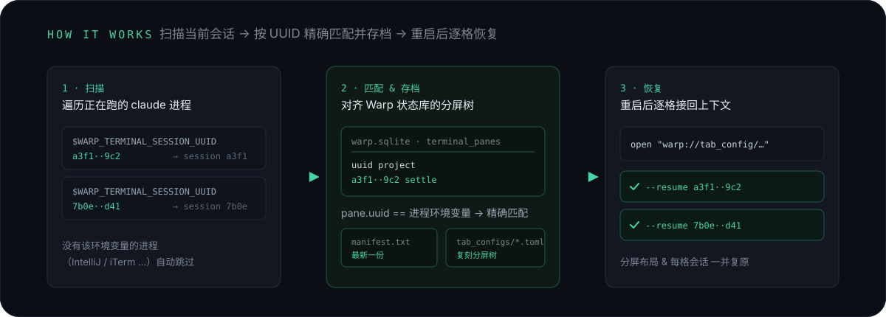

<p align="center">
  
</p>

**重启电脑前存档一次，重启后一键把 Warp 里所有正在跑的 agent 会话（Claude Code + Grok）——连同真实的分屏布局——精确 `--resume` 接回原来的上下文。**

Warp 自己会把窗口、tab、分屏结构原样摆回来，但每个格子里都是一个全新的空 shell。这个 skill 补上最后一步：**靠 `WARP_TERMINAL_SESSION_UUID` 把「哪个格子接哪个 session」变成机器精确匹配**，而不是靠你凭印象去猜。每个 pane 各自识别自己跑的是哪个 agent，claude 和 grok 混在同一个 tab 里也能一起还原。

```text
存档：记录了 14 个会话，生成了 9 个 tab-config
恢复：9 个 tab 依次弹出，每个格子自动执行 --resume <session_id>
```

<p align="center">
  
</p>

触发这个 skill 后，会先问你这次是**存档**还是**恢复**：

- **重启前** → 选存档，自动扫描当前 Warp 里所有 agent 会话（Claude Code + Grok）和分屏布局，生成一份带唯一 ID（时间戳）的历史存档，最多保留最近 10 份。
- **重启后** → 选恢复，先列出所有历史存档（时间 / 会话数 / tab 数），你挑一份，自动打开对应的 Warp tab，按原来的分屏结构逐格恢复，每个格子里自动 `--resume` 接回对应 session。

也可以跳过 skill 直接手动执行两个脚本：

```bash
# 存档
~/.claude/skills/agent-session-restore/agent-session-snapshot.py

# 恢复：先列出所有存档（每行末尾是这份存档自己记下的构成：claude / grok 各多少个格子）
bash ~/.claude/skills/agent-session-restore/agent-restore-sessions.sh --list
# 再恢复指定的一份（latest 表示最新一份；claude 的格子固定用 mc --code 拉起，无需选择）
bash ~/.claude/skills/agent-session-restore/agent-restore-sessions.sh <snapshot-id>
```

<p align="center">
  
</p>

1. **会话精确定位**：每个 Warp pane 里运行的 claude 进程，环境变量都带 `WARP_TERMINAL_SESSION_UUID`，跟 Warp 状态库（`~/Library/Group Containers/2BBY89MBSN.dev.warp/.../warp.sqlite`）里 `terminal_panes.uuid` 字段是完全相同的值——靠这个做精确匹配，不是靠猜 cwd 或顺序。读取另一个进程的环境变量用的是 `psutil`。
2. **两个 agent 的会话索引不同**：claude 走 `~/.claude/sessions/<pid>.json`（一个进程一个文件）；grok 走 `~/.grok/active_sessions.json`（一张存活登记表）。grok 进程自身的环境变量里**没有** `GROK_SESSION_ID`（只注入给子进程），所以 `pid → session_id` 得靠这张表、或者靠进程命令行里的 `--resume <session_id>`。**两条路缺一不可**：这张登记表会漏登活着的会话（实测 12 个在跑的 grok 进程只登记了 8 个），只按登记表存档会让漏掉的那些直接消失；反过来它也可能留着早已退出、pid 又被回收的陈旧条目，照读会凭空造出一个"活会话"并塞进某个格子（脚本用"进程启动时间比登记时间晚 5 分钟以上"识别这种情况并跳过）。grok 的会话还按 cwd 落盘在 `~/.grok/sessions/<URL 编码的 cwd>/<session-id>/`，恢复前脚本会校验目录还在不在，不在就把该格子的 `commands` 去掉、降级成普通 shell（不会开出一个一启动就报 `session not found` 的 pane）。
3. **真实分屏树还原**：同一个 sqlite 库的 `windows` / `tabs` / `pane_nodes` / `pane_branches` / `terminal_panes` 表记录了完整的窗口/tab/分屏结构，据此还原出跟原来一模一样的分屏布局（横切/竖切、任意嵌套层级）。
4. **恢复机制**：生成 Warp 的 Tab Config（`~/.warp/tab_configs/*.toml`），用 `open "warp://tab_config/<name>"` 非交互触发打开。<br>**踩过的坑**：分屏根节点的判定规则是「文件里第一个 `[[panes]]` 条目」（源码 `warpdotdev/warp` 的 `resolve_pane_tree`），不是看 id 叫什么——写错顺序会静默退化成只开第一个 pane，不报错。
5. **只认 Warp 里的会话**：没有 `WARP_TERMINAL_SESSION_UUID` 的进程（跑在 IntelliJ 终端、iTerm、远程桌面工具里的会话）会被自动跳过，不会被错误地当成 Warp 会话处理。
6. **一个格子里的多个会话**：`mc --code` 启动时 `mc` + `claude` 是两个进程但只有一个会话（登记表里只记 claude 本体，天然不重复计数）。另外两类也**不算**独立会话、不会被恢复成额外 tab：登记表把同一个 pid 记在多个 session_id 上（一个进程只有一个终端画面），以及在同一格子里被别的会话嵌套起来的（fork 跑挂了、agent 用 shell 工具又拉起一个——判定依据是它的进程祖先链里坐着同格子里另一个会话的进程）。只有**真正独立**的多个会话（Ctrl-Z 挂了旧的又开了新的，pid 和祖先链都对不上）才会一个回原格子、其余各自另开一个 tab，会话都不丢。

<p align="center">
  
</p>

> 张三习惯在 Warp 里开十几个 tab，每个 tab 还常常竖切、横切出好几个 pane，每个格子里都跑着一个 agent 会话（Claude Code，或者 Grok）——有的在改后端代码，有的在盯着一个长任务，有的开着专门用来问问题。这种工作状态是攒出来的，不是一次性搭好的，中途要装个系统更新、或者单纯需要重启一下，就意味着这十几个会话全部被杀掉。
>
> 电脑重启后，Warp 自带的记忆功能会把窗口、tab、分屏结构原样摆回来——这一步不用张三操心。但摆回来的每个格子里都是一个全新的空 shell，之前跑的 agent 进程早就没了。张三对着这一排空格子，只认得出印象最深的两三个，剩下的懒得一个个去猜「这个格子之前是哪个项目、该接哪个 session id」，干脆放弃，直接开新会话重新开始。
>
> 现在重启前，张三触发这个 skill 时选「存档」，几秒钟后终端打印出「记录了 14 个会话，生成了 9 个 tab-config」。重启完，再触发一次选「恢复」，Warp 自动弹出这 9 个 tab——**每个格子里该接的 `--resume <session_id>` 命令已经自动填好并执行**，不用凭印象去猜哪个格子对应哪个会话，全部精确接回原来的上下文。
>
> 对张三来说，这个 skill 的价值不是「复刻分屏布局」（Warp 自己就会做），而是**把「哪个格子该接哪个会话」这件只有人脑才记得住的事，变成机器精确匹配**。以前因为对不上号，大部分会话直接放弃重开；现在重启前随手存档一次，重启完所有会话原样接回来。

<p align="center">
  
</p>

- **不保证 100% 分毫不差**：Warp 自己的状态库写入有轻微延迟，极少数刚创建的 pane 可能还没同步进去——这种会话会退化成单独恢复一个不分屏的 tab（不会丢失，只是布局退化）。
- **只管 Warp 窗口里的会话**：跑在其他终端里的 agent 不在这套工具的管理范围内。
- **pane 尺寸恢复不了、只能均分**：Warp 的 tab-config 格式没有尺寸字段（源码里 `TabConfigPaneNode` 带 `deny_unknown_fields`，硬塞会解析失败），属 Warp 硬限制。切分方向、层级、数量、内容都能精确还原，唯独尺寸比例会被重置成等分。
- **claude 的格子固定用 `mc --code` 拉起**：`mc --code --dangerously-skip-permissions --resume {session_id}`，不再问用哪个启动命令；grok 的格子始终用 `grok --always-approve --resume {session_id}`。脚本仍保留可选的第二个参数（`agent-restore-sessions.sh <snapshot-id|latest> [mc|claude]`，默认 `mc`），只在需要手动换成裸 `claude --dangerously-skip-permissions --resume {session_id}` 时才用，恢复前会把 claude 的命令前缀改写过去、session_id 不变。
- **存档目录是自包含的**：每份存档的构成（`claude X / grok Y`）在存档时写进自己的 `meta.txt` 第 4 行，`--list` 末列和 `--agents <snapshot-id>` 读的都是它，不去翻会被恢复过程改写、删掉的 `~/.warp/tab_configs/*.toml`（否则同一份存档的构成会随外部状态漂移）。早期存档没记这一行，显示 `未知`。
- **同一格里嵌套起的会话、以及登记表把同一个 pid 挂到多个会话上的那些不恢复**：它们本来就不占独立终端格子，恢复出来只会是你从没打开过的窗口（见原理第 6 条）。

## 依赖

| 依赖 | 说明 |
|------|------|
| macOS + Warp 终端 | 核心机制依赖 Warp 的状态库和 tab_config |
| Python 3 + `psutil` | `pip3 install --user psutil` |
| `~/.claude/sessions/*.json` | Claude Code 会话记录（不同版本目录结构可能有差异）|
| `~/.grok/active_sessions.json` | Grok 的存活会话登记表（`pid → session_id` 的来源之一，会漏登，故另有进程命令行兜底）|
| `~/.grok/sessions/` | Grok 会话落盘目录，按 URL 编码的 cwd 分目录 |

<p align="center">
  
</p>

将 `agent-session-restore/` 目录复制到 `~/.claude/skills/` 下：

```bash
cp -r agent-session-restore ~/.claude/skills/
```
