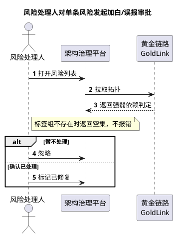
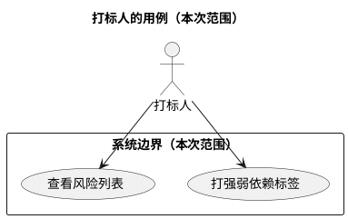
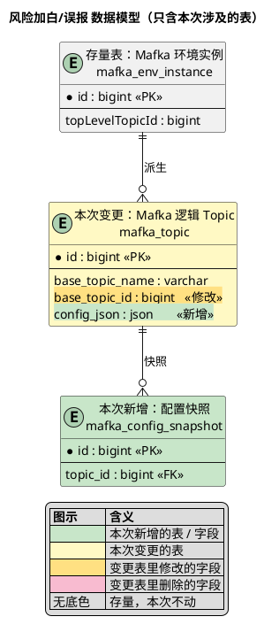

# 图表规范

专业模式要画三类图。**画之前必须读本文件** —— 图画错了比不画更糟：业务方看不懂，就直接失去了"用模型对齐理解"的意义。

一条总判据贯穿三类图：

> **一个不了解这个系统实现的产品经理，看得懂吗？看不懂就是画错了。**

---

## 一、业务序列图（最容易画错的）

**它回答的是：谁（人 / 外部系统）在什么时候，对谁做了什么。**

### 🔴 必写：图标题 —— 标题要说清「谁在干什么」

文档里图只以图片形式出现（`![[diagrams/序列图-{流程名}.svg]]`），章节名统一是「2.2 业务序列图」。
**没有标题的图在文档里就是一排无名方块**，读者看第二张时已经忘了第一张讲的是哪条流程。

所以标题要写进图里（PlantUML `title`），**跟着图走** —— 图被单独复制、贴进评审材料时标题也还在。
文档里不再重复写图题。

| 项 | 要求 |
|---|---|
| 格式 | `{谁} + {做什么}`，一句业务动作描述 |
| 判据 | 只读这一行，就知道这条流程在解决什么事 |
| 写法 | `title` 紧跟在 `@startuml` 之后、`autonumber` 之前；过长用 `\n` 换行 |

| ✅ | ❌ |
|---|---|
| 风险处理人对单条风险发起加白/误报审批 | 流程一 |
| 打标人给入口标记强弱依赖 | 序列图2 |
| 审批人对加白申请做四人会签 | 加白 |

**写不出标题，说明这条流程还没想清楚** —— 先回去把它到底在干什么弄清楚，再画图。
标题同样受下一条红线（消息的）约束：不出现类名、表名、接口路径、字段。

### 🚫 红线一：泳道只能是「我方系统边界之外」的

| ✅ 可以当泳道 | ❌ 不可以当泳道 |
|---|---|
| 人（角色）：运营人员、打标人、风险处理人 | 内部类 / 任务：`MafkaConfigSyncJob`、`XxxService`、`XxxJob`、`XxxHandler` |
| 外部系统：Crane 调度平台、Mafka 开放平台、黄金链路 | 内部存储：数据库、AGE 图库、缓存、MQ |
| **本系统整体 —— 且只占一条泳道**：架构治理平台 | 把本系统拆成多条：标签系统 / 图谱服务 / 风险模块 |

**判据：它在我的系统边界里面还是外面？里面的，一律不画。**

> 内部存储（图库、DB、MQ）是最容易漏的一类 —— 它们是本系统的实现细节，业务方根本不关心数据存在哪。

### 🚫 红线二：消息只能是业务动作，不能是接口细节

| ✅ 业务动作 | ❌ 接口细节 |
|---|---|
| 提交筛选条件 | `/api/topic/config/query?topicName=物理名` |
| 拉取该入口的拓扑 | `[(物理名, environment), ...]` |
| 返回弱依赖判定 | `7,356 + 9,236 = 16,592 个节点` |
| 标记已修复 | `topic 47%，消费组 63%` |

路径、字段结构、数据量、百分比、表名、方法名、SQL、日志 —— 全都不该出现。

### 数据、实测值、技术风险放哪

**不放图上。** 图只画交互。

- 数字、字段、实测结论、技术风险 → 写成**图下方的正文段落**，或单独一节「本图暴露的问题」
- 图上的 `note` 只写**业务规则或例外**，例如"标签组不存在时返回空集，不报错"。**不写量级、不写百分比、不写字段名**

> 这条最容易被违反：你刚查完线上数据，手边正好有实测值，顺手就写进 note 了。记住 —— 专业的体现是**你查过、并且据此得出了业务结论**，不是把原始数据糊在图上。

### 粒度

- 一张图只讲**一条业务流程**，不要塞多个
- 步骤 ≤ 15，超了就拆图

### 模板

画法约定：`title` 写业务动作（谁干什么）；人用 `actor`（火柴人），外部系统用 `participant`（方块）；加 `autonumber`；分支用 `alt / else / end`。

---

## 二、用例图

**它回答三个问题：谁（参与者）、为了什么目的（用例）、系统边界在哪。**

**标题同理必写**（见第一节的图标题规则）：拆成多张时，标题要说明这张图覆盖的是谁 / 哪片范围，例如
`title 风险处理人的用例（本次范围）`。图在文档里只是一张图片，没标题就分不出哪张是哪个参与者的。

### 参与者与用例

| ✅ 参与者 | ❌ 不是参与者 |
|---|---|
| 人（角色）：打标人、风险处理人 | Controller / Service / Repository |
| 外部系统：GoldLink、上游归档系统、定时调度平台 | 内部表、内部模块 |

**用例必须是"完整目标"，不是"一次操作"。** 判据：参与者做完这件事，是否达成了对他有意义的结果？

- ✅ 「查看风险列表」「打强弱依赖标签」
- ❌ 「点击查询按钮」「调用 addTag 接口」

**用例名从参与者视角命名**：动词 + 宾语。

### `<<include>>` / `<<extend>>` 别乱用

- `include` = **无条件包含**的子流程
- `extend` = **条件触发**的扩展

它们**不是函数调用关系** —— 拿它画调用链是最常见的误用。

### 粒度与布局

- 用例超过 8 个就**按参与者拆成多张图**，否则布局会很宽
- 参与者放在 `rectangle` **外面**，用例放在**里面**

> ⚠️ **已知布局坑**：用 `..> : <<include>>` 或 `<<extend>>` 时，被指向的用例**会被排到边界框外面**，边界就画错了。规避：优先用普通关联边；确实要表达 include/extend 时，给该用例补一条参与者的关联边，把它拉回框内。

---

## 三、数据模型图

澄清阶段画的是**概念模型** —— 实体 + 关系 + 关键字段，**只用来确认"我理解对了吗"**，不追求物理精度。

**标题同理必写**：`title 风险加白/误报 数据模型（只含本次涉及的表）` —— 一张图只覆盖一片范围时，
标题要让人知道这片范围是什么，而不是只写「数据模型」。

### 命名

- **节点用「中文名 + 换行 + 真实表名」**：`entity "风险记录表\ntag_value_risk"`
- 只写英文表名可读性差；只写中文又对不上代码
- **字段名保留英文**（那是数据库列名），不翻译
- 关系名用**中文业务语义**（"被标注"、"逻辑关联"），不写 `has_many`

### 范围

- **只画本次涉及的表**，不画全库
- 被引用但不改的表可以画成孤立节点并注明"不改动"

### 🔴 增量可视化（必做）

**只画"现状长什么样"的图没有价值 —— 必须让人一眼看出本次动了什么。**
新增的表和存量的表长得一模一样，这张图对讨论毫无帮助。

**1. 表级用填充色区分**

| 语义 | 填充色 |
|---|---|
| 本次**新增**的表 | 绿 `#C8E6C9` |
| 本次**变更**的表 | 黄 `#FFF9C4` |
| 存量、本次不动 | 无 |

**2. 字段级必须标出变更**（只标"变更表"内的字段；新增表整表都是新的，不用逐字段标）

| 语义 | 字段底色 |
|---|---|
| 该表内**新增**的字段 | `#C8E6C9` |
| 该表内**修改**的字段 | `#FFE082` |
| 该表内**删除**的字段 | `#F8BBD0` |

**3. 内嵌结构也要着色**

JSON 字段展开的「配置结构」、非独立节点的虚线框 —— 这类**内嵌结构同样要按增量语义上色**，
不能因为它是"附属内容"就只画虚线框不上色。

- **整体继承父字段的增量语义**：父字段是新增的 → 整个内嵌结构都是新增 → 整体填绿 `#C8E6C9`
- 父字段是变更、内部只有部分子字段变的 → 内嵌结构内部**逐字段标**（同字段级规则）
- 存量内嵌结构 → 无色

> ⚠️ **实测踩过**：父字段 `config_json : JSON «新增»` 标了绿底，但它展开出来的虚线框是无色的，
> 里面列了二十来个字段 —— 看图根本分不出这些字段是新是旧，等于白标。
>
> PlantUML 写法：把内嵌结构也声明成一个 `entity`，直接加填充色：
> `entity "Topic 配置结构\n（内嵌，非独立节点）" as inner #C8E6C9 { ... }`

**4. 颜色之外必须有文字标记**：`<<新增>>` / `<<修改>>` / `<<删除>>`。
颜色不能单打独斗 —— 打印成黑白、或色弱的人看，颜色就失效了。

**5. 必须带图例**，用 PlantUML 的 `legend` 生成。图例里要说明虚线框的含义（内嵌结构，非独立节点）。

> ⚠️ **底色对比度**：字段底色必须比表底色**深一档**。表填 `#FFF9C4`（很浅）时，
> 字段再用 `#FFF3C4` 这种同系浅色会**完全看不出来** —— 实测踩过这个坑。

实测渲染通过的示例：

> 澄清阶段特别说明：把"哪些是新增、哪些是改存量"标出来，**用户才能聚焦到真正要拍板的地方** ——
> 存量部分他只需扫一眼确认没动错，新增部分才需要仔细看。

### 与业务序列图的关系

画完模型后必须做**双向核对**（见 `model-protocol.md`）—— 这一步才是模型图的价值所在。**光画图不核对，等于没做。**

---

## 四、出图自检（三类图都过一遍）

**三类图共同**
- [ ] 图里有标题（PlantUML `title`）？标题说得清这张图在干什么 / 覆盖哪片范围，而不是「流程一」「序列图2」这种代号？
- [ ] 标题里没有类名、表名、接口路径、字段名？

**业务序列图**
- [ ] 每条泳道都在系统边界外？本系统只占一条？
- [ ] 没有类名、任务名、表名、接口路径、字段名？
- [ ] 没有数据量、百分比、统计值？
- [ ] 消息都是业务动作，不是接口调用？
- [ ] 步骤 ≤ 15？

**用例图**
- [ ] 参与者都是外部的人或系统？
- [ ] 用例是"完整目标"，不是"一次操作"？
- [ ] 用例 ≤ 8 个？超了拆图
- [ ] 参与者都在边界框外、用例都在框内？

**数据模型图**
- [ ] 节点是中文名 + 真实表名？
- [ ] 只画了本次涉及的表？
- [ ] 关系名是中文业务语义？
- [ ] **新增的表标了绿色、变更的表标了黄色？**
- [ ] **变更表里的字段标了底色 + `<<新增>>`/`<<修改>>`/`<<删除>>`？**
- [ ] **内嵌结构（JSON 展开、虚线框）也按增量语义上了色？**
- [ ] **有图例？图例里说明了虚线框的含义？**
- [ ] 打印成黑白后还能分辨新增/变更吗？（靠文字标记兜底）
- [ ] 画完做双向核对了？
