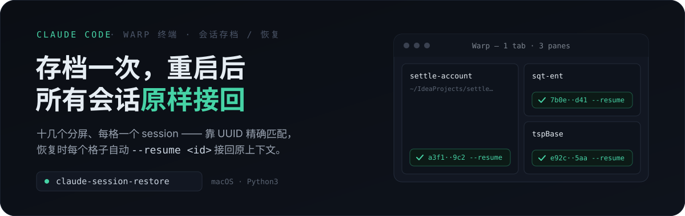

<p align="center">
  
</p>

**重启电脑前存档一次，重启后一键把 Warp 里所有正在跑的 Claude Code 会话——连同真实的分屏布局——精确 `--resume` 接回原来的上下文。**

Warp 自己会把窗口、tab、分屏结构原样摆回来，但每个格子里都是一个全新的空 shell。这个 skill 补上最后一步：**靠 `WARP_TERMINAL_SESSION_UUID` 把「哪个格子接哪个 session」变成机器精确匹配**，而不是靠你凭印象去猜。

```text
存档：记录了 14 个会话，生成了 9 个 tab-config
恢复：9 个 tab 依次弹出，每个格子自动执行 --resume <session_id>
```

<p align="center">
  
</p>

触发这个 skill 后，会先问你这次是**存档**还是**恢复**：

- **重启前** → 选存档，自动扫描当前 Warp 里所有 Claude Code 会话和分屏布局，生成一份存档（只保留最新一份，不用管理多份）。
- **重启后** → 选恢复，读取上一次的存档，自动打开对应的 Warp tab，按原来的分屏结构逐格恢复，每个格子里自动 `--resume` 接回对应 session。

也可以跳过 skill 直接手动执行两个脚本：

```bash
# 存档
~/.claude/skills/claude-session-restore/claude-session-snapshot.py

# 恢复
bash ~/.claude/skills/claude-session-restore/claude-restore-sessions.sh
```

<p align="center">
  
</p>

1. **会话精确定位**：每个 Warp pane 里运行的 claude 进程，环境变量都带 `WARP_TERMINAL_SESSION_UUID`，跟 Warp 状态库（`~/Library/Group Containers/2BBY89MBSN.dev.warp/.../warp.sqlite`）里 `terminal_panes.uuid` 字段是完全相同的值——靠这个做精确匹配，不是靠猜 cwd 或顺序。读取另一个进程的环境变量用的是 `psutil`。
2. **真实分屏树还原**：同一个 sqlite 库的 `windows` / `tabs` / `pane_nodes` / `pane_branches` / `terminal_panes` 表记录了完整的窗口/tab/分屏结构，据此还原出跟原来一模一样的分屏布局（横切/竖切、任意嵌套层级）。
3. **恢复机制**：生成 Warp 的 Tab Config（`~/.warp/tab_configs/*.toml`），用 `open "warp://tab_config/<name>"` 非交互触发打开。<br>**踩过的坑**：分屏根节点的判定规则是「文件里第一个 `[[panes]]` 条目」（源码 `warpdotdev/warp` 的 `resolve_pane_tree`），不是看 id 叫什么——写错顺序会静默退化成只开第一个 pane，不报错。
4. **只认 Warp 里的会话**：没有 `WARP_TERMINAL_SESSION_UUID` 的进程（跑在 IntelliJ 终端、iTerm、远程桌面工具里的 claude）会被自动跳过，不会被错误地当成 Warp 会话处理。
5. **挂起任务去重**：如果某个 pane 里 Ctrl-Z 挂起过一个旧 claude、又在同一个 pane 开了新的，两者会有相同的 pane uuid——脚本只保留没被挂起的那个。

<p align="center">
  
</p>

> 张三习惯在 Warp 里开十几个 tab，每个 tab 还常常竖切、横切出好几个 pane，每个格子里都跑着一个 Claude Code session——有的在改后端代码，有的在盯着一个长任务，有的开着专门用来问问题。这种工作状态是攒出来的，不是一次性搭好的，中途要装个系统更新、或者单纯需要重启一下，就意味着这十几个会话全部被杀掉。
>
> 电脑重启后，Warp 自带的记忆功能会把窗口、tab、分屏结构原样摆回来——这一步不用张三操心。但摆回来的每个格子里都是一个全新的空 shell，之前跑的 claude 进程早就没了。张三对着这一排空格子，只认得出印象最深的两三个，剩下的懒得一个个去猜「这个格子之前是哪个项目、该接哪个 session id」，干脆放弃，直接开新会话重新开始。
>
> 现在重启前，张三触发这个 skill 时选「存档」，几秒钟后终端打印出「记录了 14 个会话，生成了 9 个 tab-config」。重启完，再触发一次选「恢复」，Warp 自动弹出这 9 个 tab——**每个格子里该接的 `--resume <session_id>` 命令已经自动填好并执行**，不用凭印象去猜哪个格子对应哪个会话，全部精确接回原来的上下文。
>
> 对张三来说，这个 skill 的价值不是「复刻分屏布局」（Warp 自己就会做），而是**把「哪个格子该接哪个会话」这件只有人脑才记得住的事，变成机器精确匹配**。以前因为对不上号，大部分会话直接放弃重开；现在重启前随手存档一次，重启完所有会话原样接回来。

<p align="center">
  
</p>

- **不保证 100% 分毫不差**：Warp 自己的状态库写入有轻微延迟，极少数刚创建的 pane 可能还没同步进去——这种会话会退化成单独恢复一个不分屏的 tab（不会丢失，只是布局退化）。
- **只管 Warp 窗口里的会话**：跑在其他终端里的 claude 不在这套工具的管理范围内。
- **恢复命令写死在脚本里的 `RESUME_CMD`**（默认 `mc --code --dangerously-skip-permissions --resume {session_id}`），如果你的启动命令不是 `mc` 别名、或者不想带 `--dangerously-skip-permissions`，改一下脚本里这个常量即可。

## 依赖

| 依赖 | 说明 |
|------|------|
| macOS + Warp 终端 | 核心机制依赖 Warp 的状态库和 tab_config |
| Python 3 + `psutil` | `pip3 install --user psutil` |
| `~/.claude/sessions/*.json` | Claude Code 会话记录（不同版本目录结构可能有差异）|

<p align="center">
  
</p>

将 `claude-session-restore/` 目录复制到 `~/.claude/skills/` 下：

```bash
cp -r claude-session-restore ~/.claude/skills/
```
